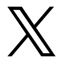
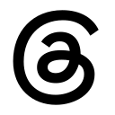

<h1 align="center">Hi, I'm Rony</h1>

My stack is currently full and I'm a developer.

  
   &nbsp;
  
   &nbsp;
  
  &nbsp;
  
  &nbsp;
  

---

## Who Am I?

I'm a developer. I build software. Specifically, software that lives on the web.
 
I don't know everything, and I don't think I ever will. That's one of the reasons I enjoy programming.

---

<h2>Tech Stack</h2>

  

  

---

## Featured Projects

### WorkSphere
Job platform built with the MERN stack.

### Travault
Travel planning platform.

### NextHeadline
Modern news application.

### BookNest
Online reading platform.

---

  Built with coffee and <code>console.log()</code>.

