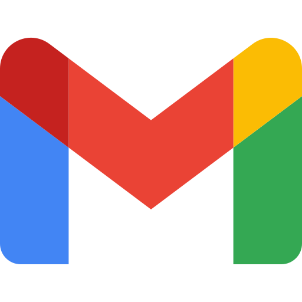

<h1 align="center">Hi, I'm Rony</h1>

---

## About Me

I'm a full stack developer who enjoys building fast, clean, and user focused web applications. I enjoy turning ideas into polished products while continuously improving my skills in software engineering and product development.

---

<h2>Tech Stack</h2>

  
  
  
  
  
  
  

---

## Featured Projects

### WorkSphere
Job platform built with the MERN stack.

### Travault
Travel planning platform.

### NextHeadline
Modern news application.

### BookNest
Online reading platform.

---

## Currently

* Building full stack applications
* Learning system design
* Improving UI engineering

---

Thanks for stopping by!

